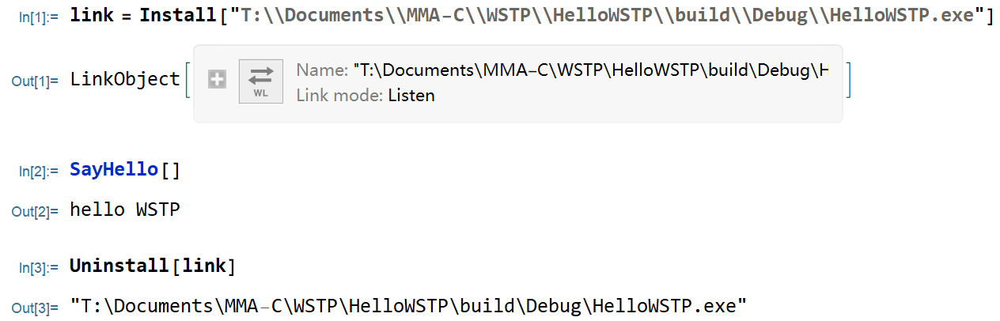

# Mathematica C/C++ Programing Tutorial (WSTP)

Anke Tang

## Table Of Contents

- [Mathematica C/C++ Programing Tutorial (WSTP)](#mathematica-cc-programing-tutorial-wstp)
  - [Table Of Contents](#table-of-contents)
  - [WSTP Template file (the suffix is generally *.tm)](#wstp-template-file-the-suffix-is-generally-tm)
    - [***ArgumentTypes*** and ***ReturnType*** data type correspondence](#argumenttypes-and-returntype-data-type-correspondence)
  - [CMake project configuration](#cmake-project-configuration)
    - [CMake installation](#cmake-installation)
    - [compiler installation](#compiler-installation)
  - [Example C++ Project configuration](#example-c-project-configuration)

## WSTP Template file (the suffix is generally *.tm)

| WSTP template file field | description                                                  |
| :----------------------- | ------------------------------------------------------------ |
| :Begin:                  | begin the template for a particular function                 |
| :Function:               | the name of the function in the external program             |
| :Pattern:                | the pattern to be defined to call the function               |
| :Arguments:              | the arguments to the function                                |
| :ArgumentTypes:          | the types of the arguments to the function                   |
| :ReturnType:             | the type of value returned from the function                 |
| :End:                    | end the template                                             |
| :Evaluate:               | Wolfram Language input to evaluate when the function is installed (**optional**) |
| ::*text*                 | treat as a comment (**optional**)                            |

for example:

```
:Begin:
:Function:       MyFunction
:Pattern:        myfun[a_Integer]
:Arguments:      {a}
:ArgumentTypes:  {Integer}
:ReturnType:     Integer
:End:
```

### ***ArgumentTypes*** and ***ReturnType*** data type correspondence

| Wolfram Language specification | C specification  | Description                                           |
| :----------------------------- | ---------------- | ----------------------------------------------------- |
| **Integer**                    | int(int32_t)     | integer                                               |
| Integer16                      | short(int16_t)   |                                                       |
| Integer32                      | int(int32_t)     |                                                       |
| Integer64                      | long(int64_t)    |                                                       |
| **Real**                       | double           | floating-point number                                 |
| Real32                         | float            |                                                       |
| Real64                         | double           |                                                       |
| **IntegerList**                | int*,**long**    | list of integers, **ArgumentType** only               |
| Integer16List                  | int16_t*,int     |                                                       |
| Integer32List                  | int32_t*,int     |                                                       |
| Integer64List                  | int64_t*,int     |                                                       |
| **RealList**                   | double*,**long** | list of floating-point numbers, **ArgumentType** only |
| Real32List                     | float*,int       |                                                       |
| Real64List                     | double*,int      |                                                       |
| **String**                     | char*            | character string                                      |
| **Symbol**                     | char*            | symbol name                                           |
| **Manual**                     | void             | call WSTP routines directly                           |

Mathematica document link for further reading: 

1. [*tutorial/HandlingListsArraysAndOtherExpressions*]()
2. [*ref/file/file.tm*]()

> **intN_t** is defined in "stdint.h"

We can then use binary executable program *wsprep* to generate C code file from template file.

- for Windows 64bit, it's located at:
  MATHEMATICA_INSTALL_DIR\SystemFiles\Links\WSTP\DeveloperKit\Windows-x86-64\CompilerAddtions\wsprep.exe
  MATHEMATICA_INSTALL_DIR is C:\Program Files\Wolfram Reaserch\Mathematica\12.2 by default for 12.2 version.
- for Linux 64bit system, it's located at:
  MATHEMATICA_INSTALL_DIR/SystemFiles/Links/WSTP/DeveloperKit/Windows-x86-64/CompilerAddtions/wsprep
  MATHEMATICA_INSTALL_DIR is /usr/local/Wolfram/Mathematica/12.2 by default for 12.2 version.

```shell
wsprep xxx.tm -o xxx.tm.c
```

## CMake project configuration

If you are not familiar with using CMake to configure and build a C/C++ project, here is a brief introduction. Otherwise, you can skip to subsection [Example C++ Project configuration](#Example C++ Project configuration).

### CMake installation

[CMake](https://cmake.org/) is an open-source, cross-platform family of tools designed to build, test and package software. CMake is used to control the software compilation process using simple platform and compiler independent configuration files, and generate native makefiles and workspaces that can be used in the compiler environment of your choice. 

- For Windows system, go to https://cmake.org/download/ to download a GUI installer, and select install option **And To PATH** either for all users or just current user.

  

  If you have installed it but not added to PATH,  you can press `WIN`+`R` and run *systempropertiesadvanced* to edit the environment variables.

- For Linux, my suggestion is to use the package management that comes with the system:

  - Ubuntu/Debian:

    ```shell
    sudo apt install cmake
    ```

  - CentOS/fedora:

    ```shell
    sudo dnf install cmake
    ```
    
### compiler installation

- For Windows users, use [*Visual Studio Installer*](https://visualstudio.microsoft.com/) to get MSVC. And I recommend using VS code as the code editor.

- For Linux, use gcc and g++.

  - Ubuntu/Debian:

    ```shell
    sudo apt install gcc g++ make
    ```

## Example C++ Project configuration

1. (optional) copy DeveloperKit to your projects directory. My directory tree is as follows.

```
├─DeveloperKit
│  ├─Linux-x86-64
│  │  ├─CompilerAdditions
│  │  ├─Documentation
│  │  │  └─English
│  │  └─SystemAdditions
│  ├─Windows-x86-64
│  │   ├─CompilerAdditions
│  │   ├─Documentation
│  │   │  └─English
│  │   └─SystemAdditions
|  ├─Project1
|  ├─Project2
...
```

2. Create a directory for your new project. Here I create a *HelloWSTP* project as an example.
3. Go to the x directory and create CMakeLists.txt.

```cmake
cmake_minimum_required(VERSION 3.10)
project(Example_addtwo)

include(../DeveloperKit/WSTP.cmake) # include predefined CMake module
file(GLOB SOURCES *.cpp)			# glob source files
add_WSTP_executable(${PROJECT_NAME})# add excutable target
```

1. create main.cpp and copy the following code into it.

```C++
#include "wstp.h"

extern int WSMain(int, char **);
#ifdef WINDOWS_WSTP
#include "windows.h"
extern HWND WSInitializeIcon( HINSTANCE hinstCurrent, int nCmdShow);
#endif


#if WINDOWS_WSTP

int PASCAL WinMain( HINSTANCE hinstCurrent, HINSTANCE hinstPrevious, LPSTR lpszCmdLine, int nCmdShow)
{
	char  buff[512];
	char FAR * buff_start = buff;
	char FAR * argv[32];
	char FAR * FAR * argv_end = argv + 32;

	hinstPrevious = hinstPrevious; /* suppress warning */

	if( !WSInitializeIcon( hinstCurrent, nCmdShow)) return 1;
	WSScanString( argv, &argv_end, &lpszCmdLine, &buff_start);
	return WSMain( (int)(argv_end - argv), argv);
}

#else

int main(int argc, char* argv[])
{
	return WSMain(argc, argv);
}

#endif

```

5. create a WSTP template file (*.tm). For example, "WSTP.tm".
6. create other source files.

```
├─DeveloperKit
│  └─...
└─HelloWSTP
   ├─CMakeLists.txt
   ├─main.cpp
   ├─WSTP.tm
   └─...
```

7. run the following code in command shell to use CMake to build project and **Install** to use WSTP program in Mathematica.

```shell
mkdir build
cd build
cmake ..
cmake --build .
```

8. Call WSTP program in Wolfram Language.

